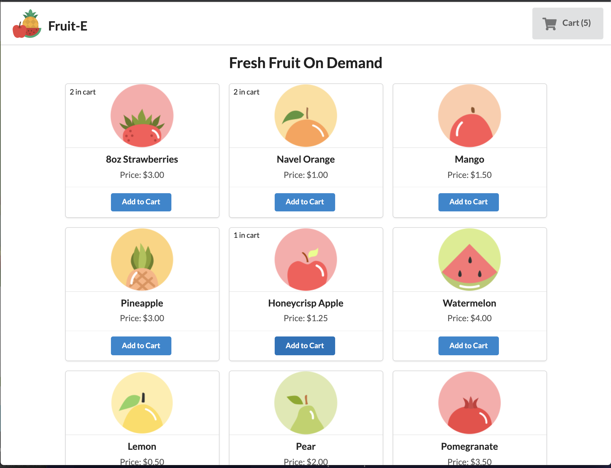
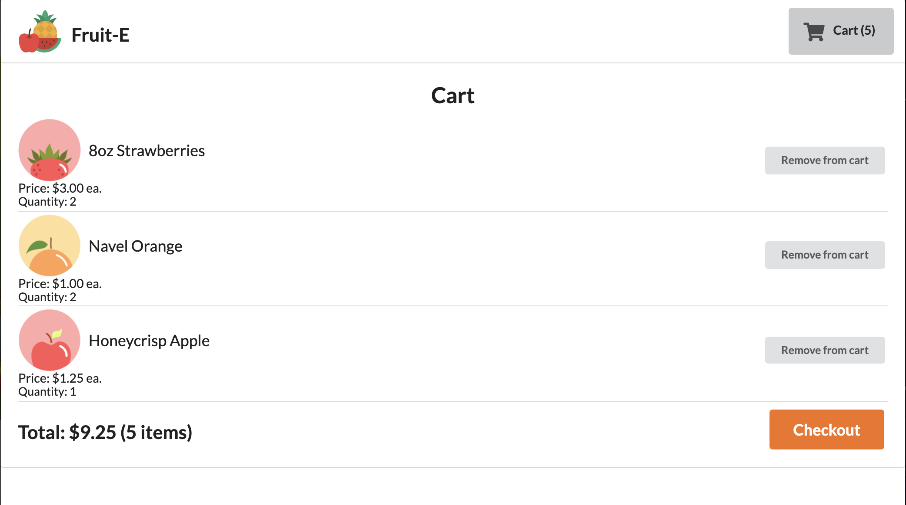
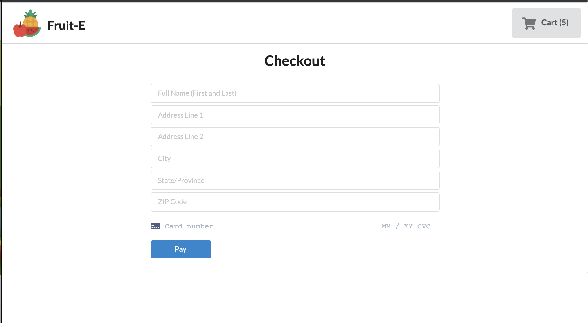
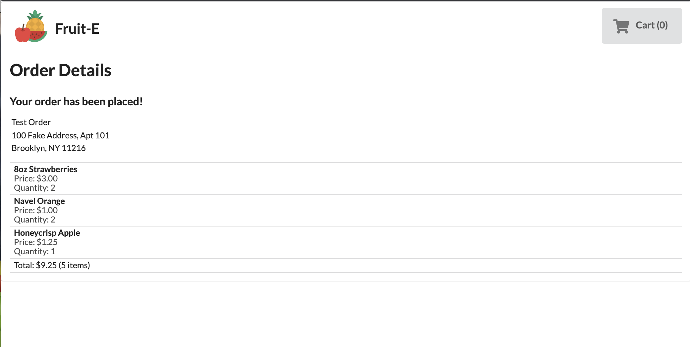

## Fruit-E

Web ecommerce platform for fruit. Available products pulled from MongoDB. Cart state management done through React's Context API. Payment processed through Stripe's API and order stored in MongoDB. Built over the course of one day.

## Built With
 - [React](https://reactjs.org/)
 - [Stripe](https://stripe.com/docs/api)
 - [Node](https://nodejs.org/en/)
 - [Express](https://expressjs.com/)
 - [MongoDB Atlas](https://www.mongodb.com/cloud/atlas)
 - [Semantic UI](https://react.semantic-ui.com/)

## Contributors 
 - [Nick Nguyen](https://github.com/nguyennick197)

## Contributing
Submit pull requests

## Screenshots

 

 

 

